# Purpose

This is the final README, it is a compilation of all the questions.

# Question 1

## Africa and Covid

Covid-19 was a global catastrophe and it is no secret that different
parts of the world were effected differently. The figures below show the
total number of cases and total number of deaths by continent. It was
common belief at the start of the pandemic that Africa would be effected
the most due to the high levels of poverty, lack of health
infrastructure compared to the rest of the world and areas with high
population density. These figures show that this was a misconception as
Africa has the least amount of cases and second least amount of deaths.
Mismeasurement is of course a concern but it is highly unlikely that it
would change the results substantially as Oceania is the closest with
respect to total cases and they has nearly double the amount of total
cases. Again when looking at deaths the gap between Asia and Africa is
so large that mismeasurement is not a valid excuse. It would be highly
informative to attempt to quantify why this was the case. I am of the
opinion that Africans have better immune systems due to the standard of
living on the continent that it was easier to fight the virus. South
America on the other hand was effected the most and as I show later this
can be partially attributed to the the lack of change in hospital
facilities.

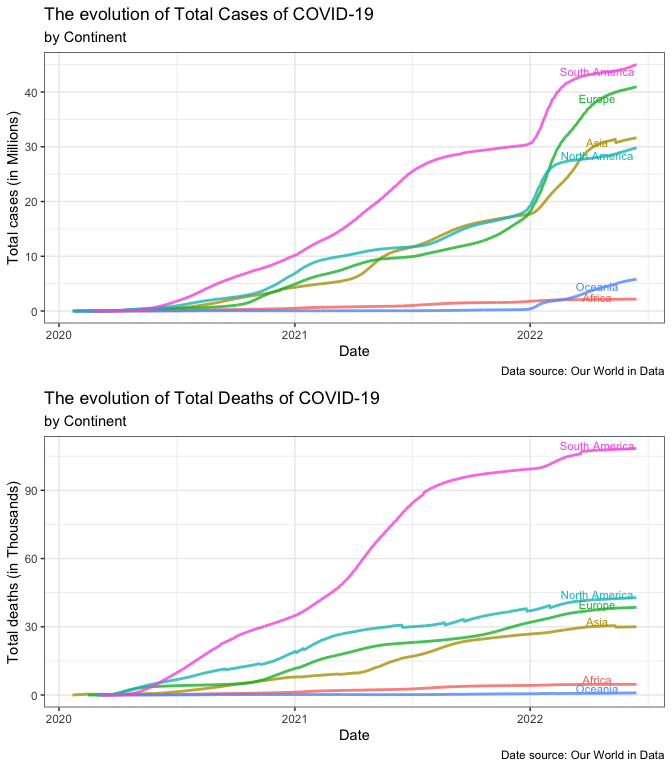

Evolution of COVID

## Respitory Deaths before and during Covid

Another idea that recieved a lot of attention during the pandemic was
the effect of smoking and the severity of Covid. To investigate this I
found the 3 countries with the highest rate of smokers (Russia, Greece
and Montenegro) all with nearly 90% of their population being smokers
and the 3 countries with the lowest rate of smoking (Ghana, Ethiopia and
Nigeria) all with less than 10% of their populations being smokers. This
could also be a reason as to why Africa was least effected as they have
smaller rate of smokers compared to the rest of the world. The table
shows that the death rates due to respitory illness (which is what Covid
is) increased at a much higher rate for top smoking countries. This
shows that smoking definitely did increase the dangers of Covid.

| year |  Ghana | Ethiopia | Nigeria |   Russia |  Greece | Montenegro |
|-----:|-------:|---------:|--------:|---------:|--------:|-----------:|
| 2017 |  17098 |    48389 |  184438 |    32515 |    5649 |         72 |
| 2018 |  16465 |    47491 |  177834 |    32667 |    5874 |         70 |
| 2019 |  16306 |    46301 |  172978 |    32972 |    5957 |         69 |
| 2020 |  53074 |   200308 |  212680 |  4952659 |  208444 |      45312 |
| 2021 | 315598 |  1582711 |  827562 | 56152636 | 4398618 |     580968 |
| 2022 | 236205 |  1231953 |  520258 | 58131077 | 4426177 |     440539 |

Deaths from Respitory illness

## Hospitalisation Facilities and ICU admissions

For this section I chose to use just three continents (Europe, Asia and
South America). Europe showd that increased hospitilastion facilities
led ICU admissions and in the early stages of 2020 actually helped to
reduce admissions. In Asia, it lagged as it was constant until late 2021
which did lead the final wave of admissions. Lastly, South America
seemed to do nothing to improve hospital facilities and their beds per
thousand of people was constant throughout the whole pandemic which
definitely contributed to being effected the worst out of all the
continents.

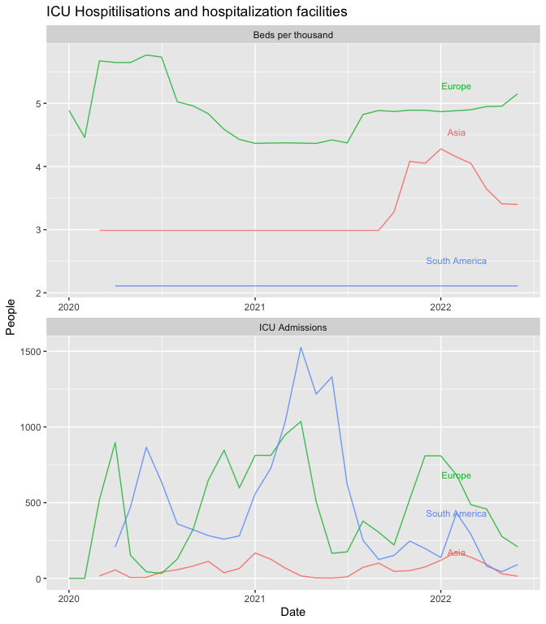

Evolution of Hospitals

# Question 2

## Is the weather better in the midlands of England or London?

Let’s start with temperature, The graphs below show that not only does
London have better weather than the midlands, but the maximum
temperature in both places is still colder than Cape town.

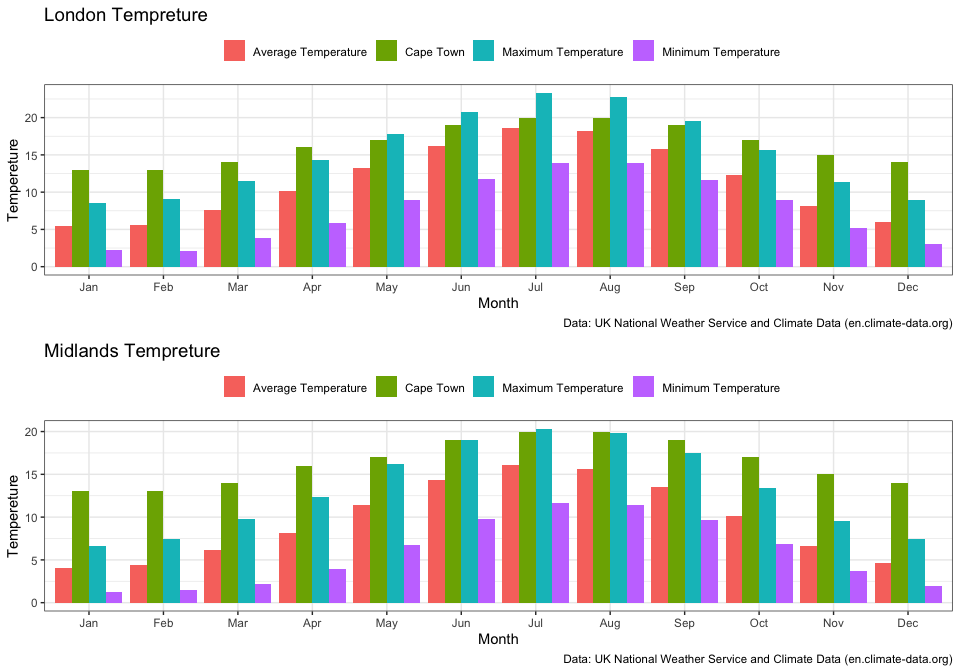

London Tempreture

## Is it more sunny or cloudy?

Now that it has been shown that the weather is better in the London than
the midlands let’s look at whether London is more sunny than cloudy. The
graph below shows that its has only been more sunny than cloudy for 1
year (2014) since 1978. Not only that but the rate of sunshine seems to
be decreasing over time as well. So it is pretty much colder, more
cloudy and more miserable.

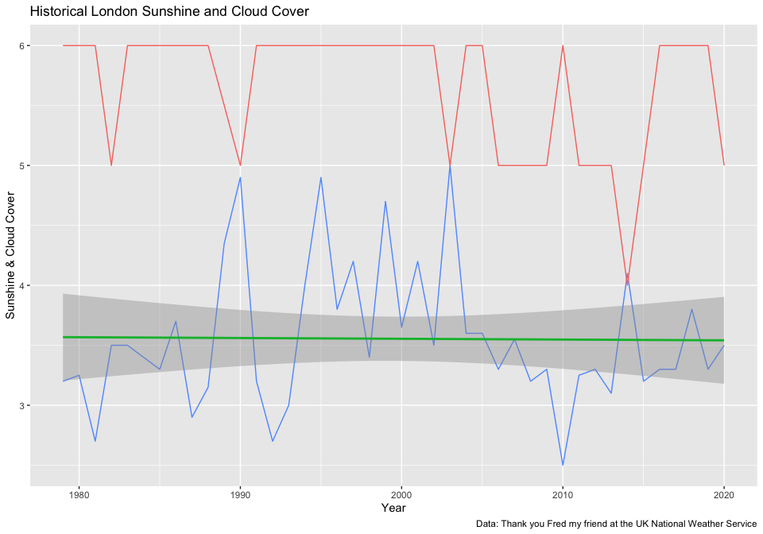

London is getting less and less sunshine

## Rain, rain and rain

We all know that Cape Town has winter rain, but that is okay cause that
is when it is cold so you will be inside anyway. In London however it
seems to be raining all the time. In Cape Town we can enjoy summer
because it barely rains but in London its going to be cold in winter,
and then in summer it is just going to rain. I hope you find a lovely
house if you do move because you are going to be spending most of your
time inside.

| Month     |    London | Cape Town |
|:----------|----------:|----------:|
| January   |  46.93538 |        17 |
| February  |  37.90725 |        16 |
| March     |  35.57757 |        18 |
| April     |  36.00551 |        50 |
| May       |  39.75882 |        72 |
| June      |  41.20288 |       112 |
| July      |  36.95202 |       103 |
| August    |  41.78320 |        90 |
| September |  38.72694 |        55 |
| October   |  55.65955 |        36 |
| November  |  50.21540 |        32 |
| December  |  47.35286 |        20 |
| Total     | 508.07736 |       621 |

London vs Cape Town Monthly Rainfall

# Question 3

# Popularity by album

The two figures below show that Coldplay’s discography is slightly more
volatile than Metallica’s in terms of popularity but overall are more
popular.

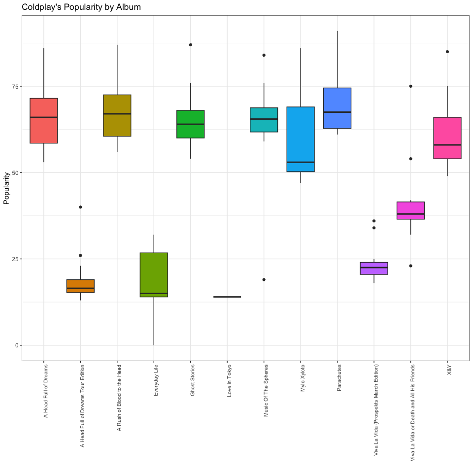

Coldplay

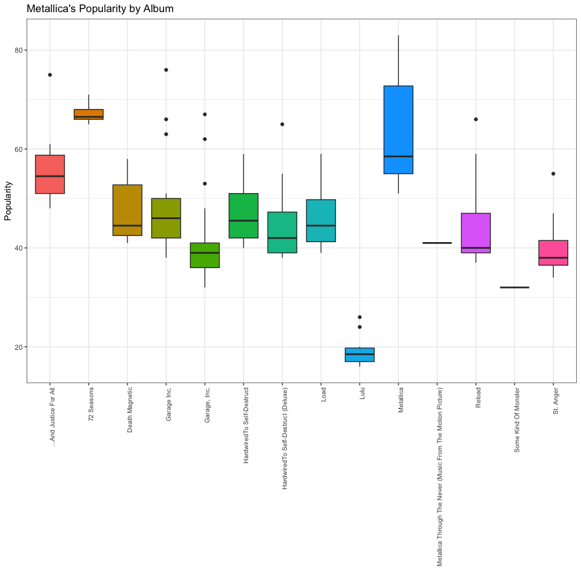

Metallics

## Components of each Band: What drives Their Popularity?

Now I show the correlation of identifying factors of both bands with
popularity. I start with energy and it seems that firstly Coldplay are
much more diverse as they have songs ranging from nearly 0 whereas
Metallica’s songs are clusered close to 1. Coldplay seem to have an
optimal energy level of between 0.4 and 0.6 and Metalica is more popular
between 0.75 and 1.

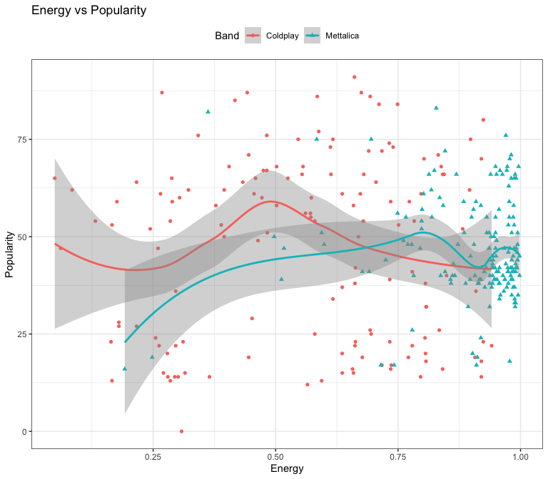

Metallics

Next looking at tempo, again Coldplay is more diverse with their songs
ranging from 60 beats per minute to over 200 whereas Metallica only
ranges from 75 to just under 200. Metallica’s popularity increases with
Tempo.

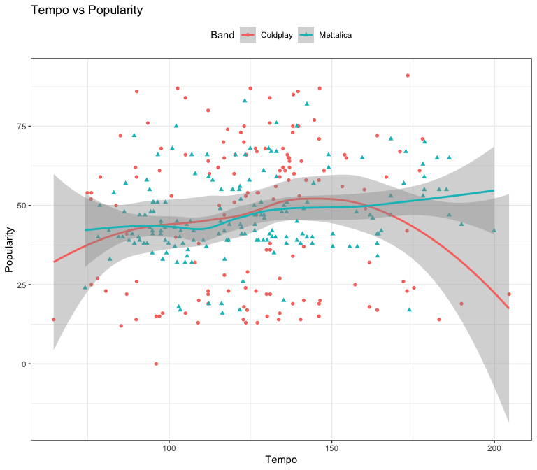

Metallics

Lastly I looked at Valence. Valence is a measure of the degree of
positive or negative sentiment associated with a particular experience,
object, or event, typically represented on a scale from 0 to 1, where 0
indicates negative valence and 1 indicates positive valence. It reflects
the subjective assessment of the emotional tone or quality of the
subject matter. Coldplay is more popular with lowe levels so their most
popular songs are more sad songs and Metalica’s popularity increases
with valence so their more upbeat songs are more popular on average.

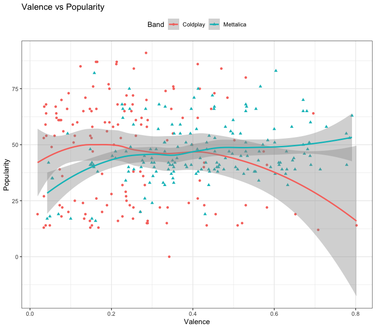

Metallics

##Most popular song by album and year. Both Metallica and Coldplay’s
most popular songs seem to have more energy through the years.
Coldplay’s tempo seems to decrease over time wheras Metallica’s tempo
has been relatibely constant.

| year | Band      | name                        | album                                                       | popularity | energy | danceability |   tempo | valence |
|---:|:-----|:------------|:-------------------------|-----:|---:|------:|----:|----:|
| 2000 | Coldplay  | Yellow                      | Parachutes                                                  |         91 |  0.661 |        0.429 | 173.372 |   0.285 |
| 2002 | Coldplay  | The Scientist               | A Rush of Blood to the Head                                 |         87 |  0.442 |        0.557 | 146.277 |   0.213 |
| 2005 | Coldplay  | Fix You                     | X&Y                                                         |         85 |  0.417 |        0.209 | 138.178 |   0.124 |
| 2008 | Coldplay  | Viva La Vida                | Viva La Vida or Death and All His Friends                   |         75 |  0.617 |        0.486 | 138.015 |   0.417 |
| 2011 | Coldplay  | Paradise                    | Mylo Xyloto                                                 |         86 |  0.585 |        0.449 | 139.631 |   0.212 |
| 2014 | Coldplay  | A Sky Full of Stars         | Ghost Stories                                               |         87 |  0.675 |        0.545 | 124.970 |   0.162 |
| 2015 | Coldplay  | Hymn for the Weekend        | A Head Full of Dreams                                       |         86 |  0.693 |        0.491 |  90.027 |   0.412 |
| 2018 | Coldplay  | A Head Full of Dreams       | Love in Tokyo                                               |         14 |  0.920 |        0.307 | 122.836 |   0.152 |
| 2019 | Coldplay  | Orphans                     | Everyday Life                                               |         32 |  0.808 |        0.503 | 107.973 |   0.282 |
| 2021 | Coldplay  | My Universe                 | Music Of The Spheres                                        |         84 |  0.711 |        0.573 | 105.006 |   0.470 |
| 1988 | Mettalica | One                         | …And Justice For All                                        |         75 |  0.695 |        0.437 | 102.178 |   0.413 |
| 1991 | Mettalica | Enter Sandman               | Metallica                                                   |         83 |  0.828 |        0.577 | 123.257 |   0.604 |
| 1996 | Mettalica | King Nothing                | Load                                                        |         59 |  0.909 |        0.528 | 112.083 |   0.349 |
| 1997 | Mettalica | Fuel                        | Reload                                                      |         66 |  0.951 |        0.491 | 106.948 |   0.555 |
| 1998 | Mettalica | Whiskey In The Jar          | Garage Inc.                                                 |         76 |  0.970 |        0.511 | 132.986 |   0.566 |
| 2003 | Mettalica | St. Anger                   | St. Anger                                                   |         55 |  0.949 |        0.249 | 185.252 |   0.498 |
| 2004 | Mettalica | Some Kind Of Monster        | Some Kind Of Monster                                        |         32 |  0.937 |        0.339 | 106.981 |   0.633 |
| 2004 | Mettalica | Some Kind Of Monster - Edit | Some Kind Of Monster                                        |         32 |  0.893 |        0.405 | 104.882 |   0.439 |
| 2008 | Mettalica | The Day That Never Comes    | Death Magnetic                                              |         58 |  0.986 |        0.334 | 124.668 |   0.480 |
| 2011 | Mettalica | Brandenburg Gate            | Lulu                                                        |         26 |  0.779 |        0.334 | 122.705 |   0.282 |
| 2013 | Mettalica | The Ecstasy Of Gold         | Metallica Through The Never (Music From The Motion Picture) |         41 |  0.691 |        0.124 |  97.395 |   0.151 |
| 2016 | Mettalica | Hardwired                   | HardwiredTo Self-Destruct (Deluxe)                          |         65 |  0.991 |        0.128 | 186.124 |   0.530 |
| 2023 | Mettalica | 72 Seasons                  | 72 Seasons                                                  |         71 |  0.981 |        0.196 | 168.183 |   0.403 |

Most popular songs each year

# Question 4

# Best Actors and Directors

Below are tables of actors that on average have the best average critic
ratings and audience ratings. It would be beneficial to have any movies
that has these actors and directors as they are likely to be the most
highest rated movies.

| directors              | IMDB Critic Score | actors             | IMDB Critic Score |
|:--------------------|----------------:|:-----------------|----------------:|
| Alastair Fothergill    |              9.00 | Hassan Mostafa     |               9.0 |
| Jonathan Hughes        |              9.00 | Karima Mokhtar     |               9.0 |
| Keith Scholey          |              9.00 | Karthik Rathnam    |               9.0 |
| Samir Al Asfory        |              9.00 | Kesava Karri       |               9.0 |
| Robert Zemeckis        |              8.80 | Krishna            |               9.0 |
| Sơn Tùng M-TP          |              8.80 | Max Hughes         |               9.0 |
| Kazim Al Qallaf        |              8.70 | Nadia Shukry       |               9.0 |
| Amy Segal              |              8.60 | Nithya Sree        |               9.0 |
| Lenin Bharathi         |              8.60 | Praneeta Patnaik   |               9.0 |
| Shantrelle P. Lewis    |              8.60 | Praveena Paruchuri |               9.0 |
| Abhijeet Deshpande     |              8.50 | Radha Bessy        |               9.0 |
| Madhumita              |              8.50 | Saeed Saleh        |               9.0 |
| Thom Zimny             |              8.50 | Younes Shalaby     |               9.0 |
| Louis C.K.             |              8.40 | Adam Cole          |               8.8 |
| Paresh Mokashi         |              8.40 | Al Harrington      |               8.8 |
| R. Parthiban           |              8.40 | Bob Harks          |               8.8 |
| Selçuk Metin           |              8.40 | Bob Penny          |               8.8 |
| Thiagarajan Kumararaja |              8.40 | Brendan Shanahan   |               8.8 |
| Bo Burnham             |              8.35 | Bryan Hanna        |               8.8 |
| Aamir Khan             |              8.30 | Byron Minns        |               8.8 |

Top Actors and Directors

| directors            | IMDB Audience Score | actors             | IMDB audience Score |
|:------------------|-----------------:|:----------------|-----------------:|
| Rick Suvalle         |               10.00 | Aaron Barashi      |                  10 |
| Francis Ford Coppola |                9.80 | Addison Holley     |                  10 |
| Oluseyi Asurf        |                9.50 | Adebimpe Akintunde |                  10 |
| Fred Ouro Preto      |                9.30 | Ahmed Saif         |                  10 |
| Navaniat Singh       |                9.30 | Akashi Mtenda      |                  10 |
| Vijay Kumar Arora    |                9.30 | Alia Almannai      |                  10 |
| Yacine Belhousse     |                9.30 | Blessing Lung’aho  |                  10 |
| Hasan Abduselam      |                9.20 | Bukola Oshibowale  |                  10 |
| Selçuk Metin         |                9.10 | Calabar Chic       |                  10 |
| Bodunrin Sasore      |                9.00 | Dai Tabuchi        |                  10 |
| Manish Saini         |                9.00 | David Bedella      |                  10 |
| Seko Shamte          |                9.00 | Derek McGrath      |                  10 |
| Shazia Ali Khan      |                9.00 | Evany Rosen        |                  10 |
| Thomas Astruc        |                9.00 | Eve D’souza        |                  10 |
| Ulises Valencia      |                8.85 | Fidel Maithya      |                  10 |
| Amy Segal            |                8.80 | Henri Charles      |                  10 |
| Choi Jin-sung        |                8.80 | Ibrahim Almeirasi  |                  10 |
| Joe Guidry           |                8.80 | Ibrahim Osward     |                  10 |
| Steve Rolston        |                8.70 | Jacob Steven       |                  10 |
| Amp Wong             |                8.60 | Jazz Mistri        |                  10 |

Top Actors and Directors

## Genres to Focus on

Below is a plot of the audience and critic rated most popular movies by
genre. There is a line at 6.5 to show movie genres that consistently get
good ratings. If you want the best rated genres I would suggest getting
historical war movies, documentaries and music movies. If you care more
about popularity I would suggest animation, sci-fi fantasy, western and
action. I think the best movies to have are war movies as they are the
best of both worlds.

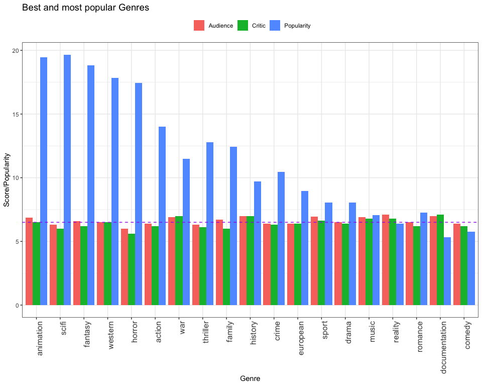

Popularity and Ratings by Grenre

## Words in descriptions

Lastly I show a wordcloud of the most popular words in descriptions of
movies that have a audience rating of more than 7. This shows what the
best movies use to market themselves and what the most popular themes
among audiences. Clearly movies about love, friends and family are the
most popular.

# Question 5

## Ratings and Positive Reviews by Category

If you want to create an App it is very important that as soon after its
inception it gets as many reviews and ratings as possible but you also
want high ratings and positive reviews. This will help your App gain
momentum as people are more likely to download your App if it has
already been rated and reviewed as it creates a sense of trust. Below I
have created the average reviews and positive ratings by category. I
limited it to the top 50% of downloads as I wanted to only imvestigate
sucessful Apps. From this i would recommend an App under the Art and
Design category as those apps get rated the most highly and have the
most positive reviews.

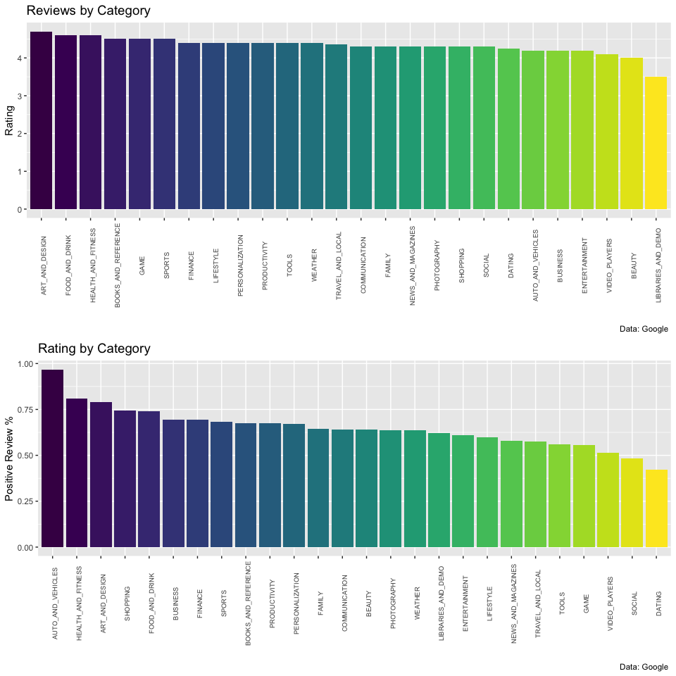

Ratings and Reviews by Category

## Does App Size affect Downloads and Ratings?

The next step in the optimization process of the app is determining how
large it should be. It os a highly common in the modern era to delete
Apps that are rather large to ensure your device has sufficient memory.
The table below shows the correlation of size with downloads and ratings
this information can help evaluate the trade-off between size,
functionality and scope of your App. Following from my recommendation
above, Art and design applications are downloaded more if they are
larger and there is no large correlation between the Rating and the size
so I would recommend ensuring functionality and scope of the App as the
size is of little concern as people do not seem deterred from
downloading apps in this genre if they are large.

| Genres                  | Downloads | Rating |
|:------------------------|:----------|:-------|
| Card                    | 56%       | 40%    |
| Trivia                  | 34%       | 35%    |
| Arcade                  | 47%       | 27%    |
| Weather                 | 23%       | 26%    |
| Personalization         | -9%       | 25%    |
| Photography             | 48%       | 25%    |
| Music & Video           | -10%      | 22%    |
| Racing                  | 1%        | 21%    |
| Role Playing            | 39%       | 21%    |
| Events                  | 24%       | 20%    |
| Casual                  | 29%       | 15%    |
| Health & Fitness        | 27%       | 15%    |
| House & Home            | 16%       | 15%    |
| Strategy                | 35%       | 15%    |
| Action & Adventure      | 35%       | 13%    |
| Productivity            | 7%        | 13%    |
| Comics                  | 37%       | 12%    |
| Puzzle                  | 29%       | 12%    |
| Brain Games             | 25%       | 9%     |
| Board                   | 5%        | 8%     |
| Communication           | 31%       | 8%     |
| Music                   | 25%       | 8%     |
| Beauty                  | 47%       | 7%     |
| Business                | 24%       | 7%     |
| Parenting               | 8%        | 6%     |
| Action                  | 19%       | 5%     |
| Maps & Navigation       | 25%       | 5%     |
| Pretend Play            | 21%       | 5%     |
| Social                  | 37%       | 5%     |
| Books & Reference       | 19%       | 4%     |
| Simulation              | 31%       | 4%     |
| Medical                 | 7%        | 2%     |
| Word                    | 44%       | 2%     |
| Auto & Vehicles         | 6%        | 1%     |
| Casino                  | 28%       | 1%     |
| Video Players & Editors | 32%       | 1%     |
| Sports                  | 46%       | -1%    |
| Tools                   | 14%       | -1%    |
| Art & Design            | 54%       | -2%    |
| Libraries & Demo        | 24%       | -5%    |
| Education               | 29%       | -6%    |
| Entertainment           | 39%       | -6%    |
| Shopping                | 53%       | -6%    |
| Adventure               | 19%       | -10%   |
| Dating                  | 25%       | -10%   |
| Finance                 | 42%       | -14%   |
| Lifestyle               | 32%       | -14%   |
| Educational             | -4%       | -18%   |
| Food & Drink            | 36%       | -18%   |
| News & Magazines        | 31%       | -22%   |
| Travel & Local          | 26%       | -22%   |
| Creativity              | -7%       | -26%   |

Correlations with App Size
